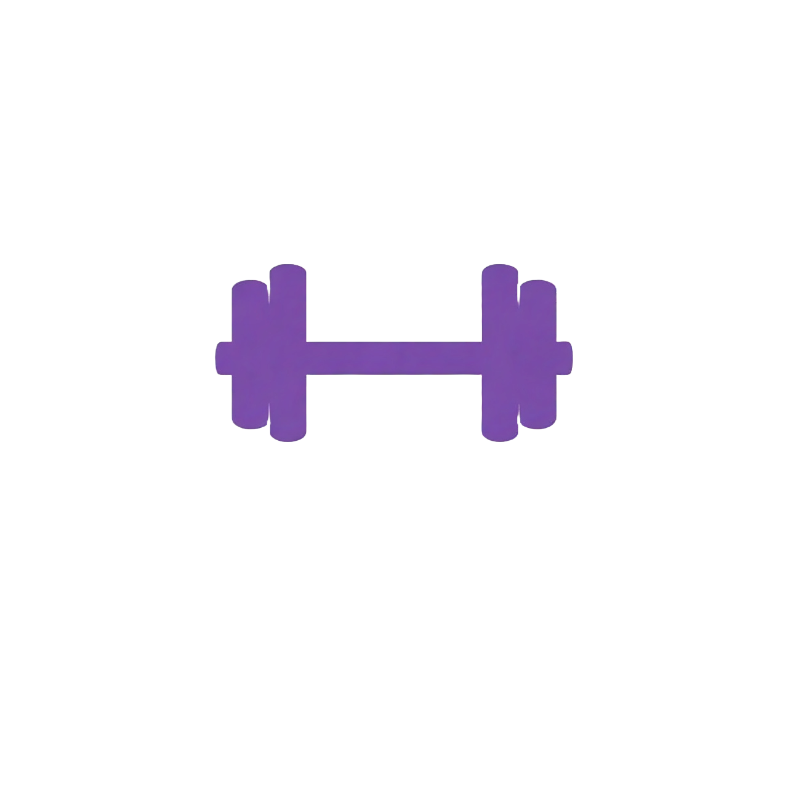
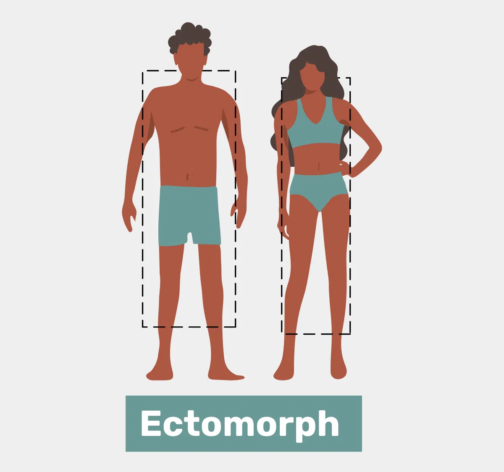
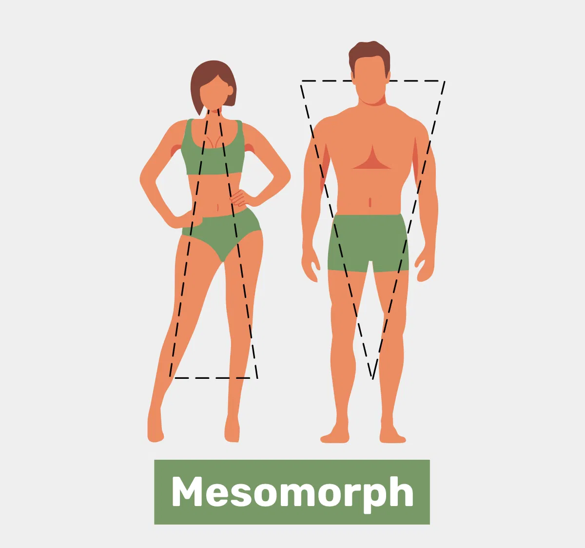
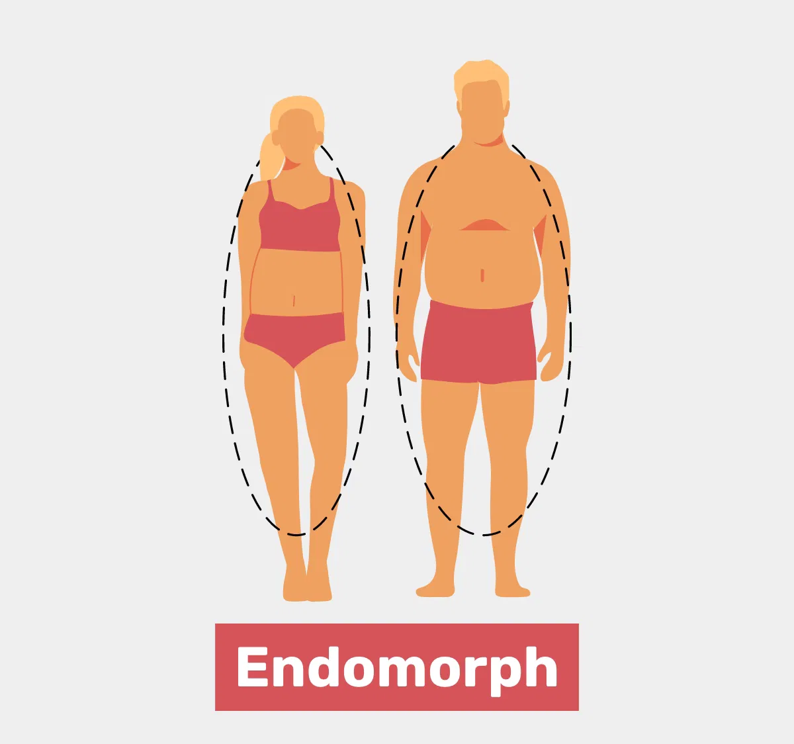
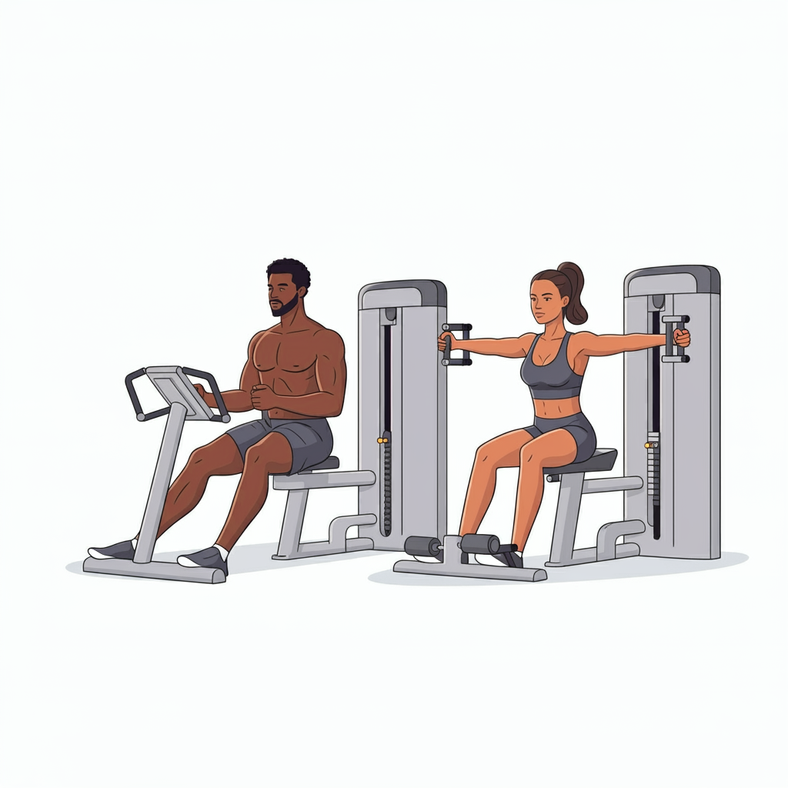
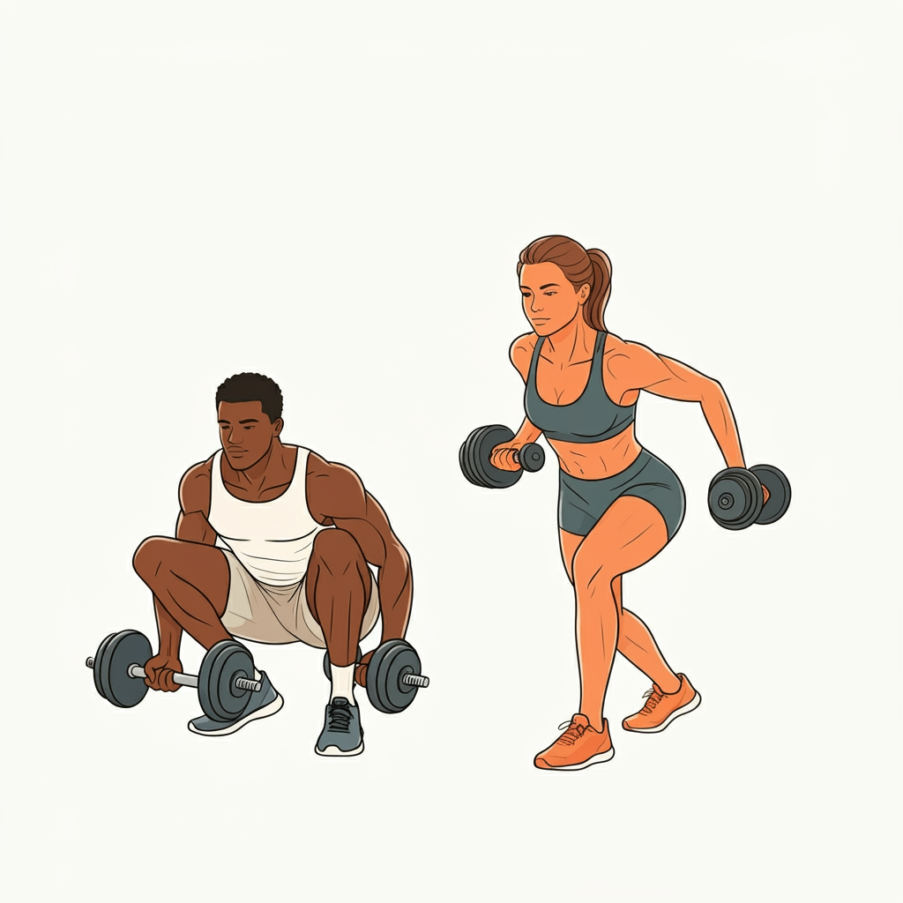
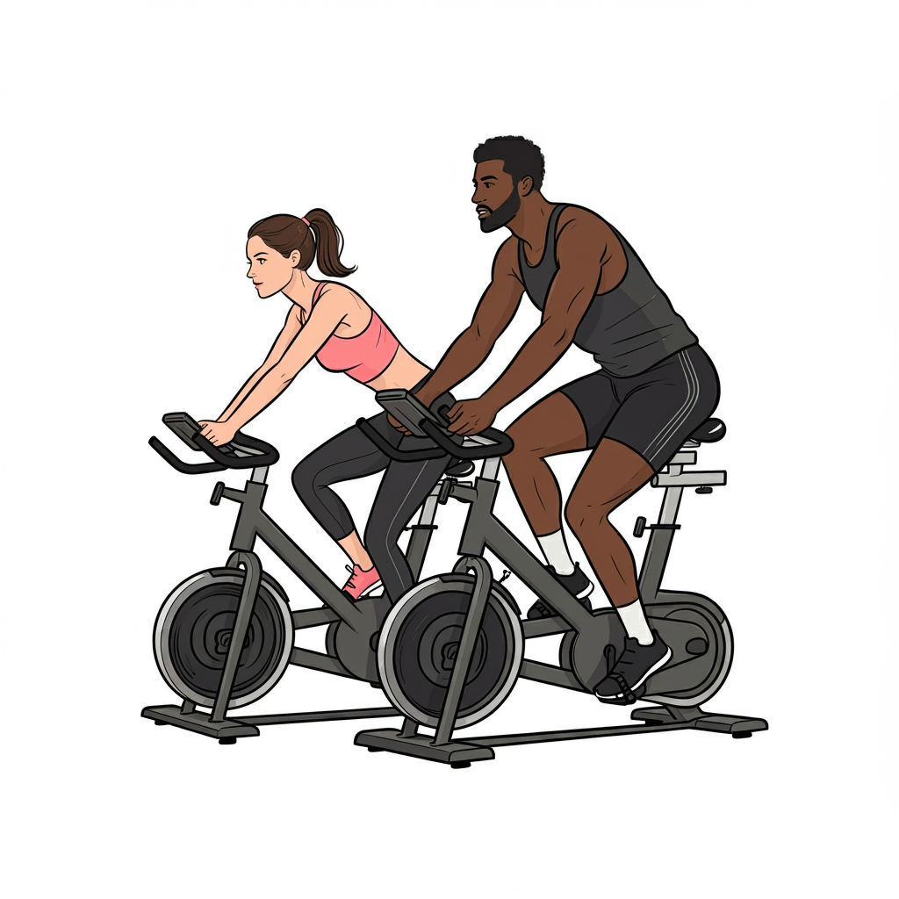

    

  <h3 align="center">Assistente de Personal Trainer - Gerador de Treino Ideal</h3>
Este projeto é um desafio de Prompt Engineer do Bootcamp "Engenharia de Prompts na AWS com Claude", da DIO, onde o objetivo é criar um prompt que ajuda a montar o treino ideal para cada combinação de fatores, como biotipo corporal, disponibilidade de tempo e tipo de exercícios preferidos. O assistente de personal trainer gerado por esse prompt será capaz de personalizar os treinos de acordo com as características e necessidades do usuário.
O projeto deve ser feito utilizando as boas práticas de prompt engineer.

## Índice

- [Introdução](https://github.com/marioluciofjr/treina_ai/blob/main/readme.md#introdu%C3%A7%C3%A3o)
- [Como utilizar o prompt](https://github.com/marioluciofjr/treina_ai/blob/main/readme.md#como-utilizar-o-prompt)
- [Estrutura do prompt](https://github.com/marioluciofjr/treina_ai/blob/main/readme.md#estrutura-do-prompt)
- [Glossário](https://github.com/marioluciofjr/treina_ai/blob/main/readme.md#gloss%C3%A1rio)
    - [Biotipos corporais](https://github.com/marioluciofjr/treina_ai/blob/main/readme.md#biotipos-corporais)
    - [Dias disponíveis para treino](https://github.com/marioluciofjr/treina_ai/blob/main/readme.md#dias-dispon%C3%ADveis-para-treino)
    - [Tipos de exercícios](https://github.com/marioluciofjr/treina_ai/blob/main/readme.md#tipos-de-exerc%C3%ADcios)
    - [Nível de atividade física](https://github.com/marioluciofjr/treina_ai/blob/main/readme.md#n%C3%ADveis-de-atividade-f%C3%ADsica)
- [Regras de negócio](https://github.com/marioluciofjr/treina_ai/blob/main/readme.md#regras-de-neg%C3%B3cio-para-criar-o-plano-de-treino)
- [Material de Apoio](https://github.com/marioluciofjr/treina_ai/blob/main/readme.md#material-de-apoio)
- [Prompt de resposta](https://github.com/marioluciofjr/treina_ai/blob/main/readme.md#prompt-de-resposta-proposto)
- [Contribuições](https://github.com/marioluciofjr/treina_ai/edit/main/readme.md#contribui%C3%A7%C3%B5es)
- [Contato](https://github.com/marioluciofjr/treina_ai/edit/main/readme.md#contato)

---

## Introdução

Este projeto visa criar um assistente de personal trainer automatizado que ajuda a gerar treinos personalizados. O usuário fornecerá informações como o biotipo corporal, a quantidade de dias disponíveis para treinar na semana e o tipo de exercício preferido, e o assistente gerará um plano de treino ideal com base nessas informações.

---

## Como utilizar o prompt

Você pode utilizar de duas formas: 

1. Copie o prompt do arquivo [plano_de_treino.md](prompt/plano_de_treino.md) e cole no modelo de linguagem de sua preferência.
2. Faça o download do mesmo arquivo e realize o upload do mesmo em modelos de linguagem multimodais, que conseguem analisar arquivos de diferentes formatos, como o Claude faz.

---

## Estrutura do prompt

O prompt é dividido em 4 partes e utiliza as técnicas de Few-shot e Chain-of-thought como engenharia de prompt: 

1. System Instrucions - tem a intenção de fornecer instruções de como o modelo de linguagem deve se comportar;
2. Glossário - explica detalhes sobre os tipos de exercício e níveis de atividade física segundo a OMS;
3. Coleta de informações - são 8 blocos de perguntas para entender melhor sobre a pessoa usuária do prompt, avaliando biotipo, prática atual de exercícios, disponibilidade para treinar, histórico de saúde, hábitos alimentares, estilo de vida e objetivo;
4. Análise e planejamento - vai analisar se o contexto da pessoa usuária corresponde a um nível moderado ou intenso de exercícios, bem como estruturar o plano de treino ideal.

---

## Glossário

### Biotipos corporais

A primeira regra para personalizar o treino é determinar o biotipo corporal do usuário. Existem três biotipos principais:

<table>
  <tr>
    <th>Imagem</th>
    <th>Biotipo</th>
    <th>Descrição</th>
  </tr>
  <tr>
    <td style="text-align: center;">
      
    </td>
    <td><strong>Ectomorfo</strong></td>
    <td>Corpo mais magro, difícil ganhar peso e massa muscular.</td>
  </tr>
  <tr>
    <td style="text-align: center;">
      
    </td>
    <td><strong>Mesomorfo</strong></td>
    <td>Corpo naturalmente musculoso, facilidade para ganhar massa muscular e perder gordura.</td>
  </tr>
  <tr>
    <td style="text-align: center;">
      
    </td>
    <td><strong>Endomorfo</strong></td>
    <td>Corpo com tendência a acumular gordura, maior dificuldade em perder peso.</td>
  </tr>
</table>

> **Nota:** Escolha o biotipo que mais se aproxima do seu corpo atual para que o treino seja mais eficiente.

---

### Dias disponíveis para treino

A segunda regra é determinar quantos dias por semana o usuário tem disponível para treinar. Dependendo do número de dias, o treino sugerido pode variar:

| **Imagem**                                                     | **Dias por Semana** | **Tipo de Treino Sugerido** |
| -------------------------------------------------------------- | ------------------- | --------------------------- |
|  | 1 dia               | Treino Full Body            |
|  | 3 dias              | Treino ABC                  |
|  | 5 dias              | Treino ABCDE                |

- **Full Body**: Treino que trabalha o corpo todo em uma única sessão.
- **ABC**: Divisão do treino em três dias, cada um focado em grupos musculares diferentes.
- **ABCDE**: Divisão do treino em cinco dias, com foco ainda mais específico em cada grupo muscular.

---

### Tipos de exercícios

A terceira regra envolve a escolha do tipo de exercício preferido. Aqui estão algumas categorias com exemplos:

| **Imagem**                                                       | **Tipo de Treino** | **Descrição**                                                                                                 |
| ---------------------------------------------------------------- | ------------------ | ------------------------------------------------------------------------------------------------------------- |
|  | **Funcional**      | Exercícios que melhoram a funcionalidade do corpo, usando movimentos naturais.                                |
|   | **Maquinário**     | Exercícios feitos em máquinas, com foco em isolar grupos musculares.                                          |
|      | **Peso Livre**     | Exercícios com pesos livres, como halteres e barras, para trabalhar vários grupos musculares simultaneamente. |
|    | **Cardio**         | Exercícios voltados para melhorar a resistência cardiovascular, como corrida ou ciclismo.                     |
|      | **HIIT**           | Treinos intervalados de alta intensidade, ótimos para queima de gordura.                                      |

---

### Níveis de atividade física

De acordo com a OMS, pessoas adultas devem praticar alguma atividade física moderada por 300 minutos semanais ou fazer 150 minutos por semana de atividade física intensa (desde que não haja contraindicação, claro).

Como saber se a atividade física é moderada ou intensa:

Se a respiração e batimentos cardíacos estão razoavelmente acelerados, mas a pessoa consegue manter uma conversa enquanto se exercita, a atividade é provavelmente moderada. Exemplos: caminhada, ciclismo leve, ioga leve, dança.

Se os batimentos cardíacos aceleram consideravelmente e a respiração está muito rápida e difícil a ponto de não permitir uma conversa, é provavelmente uma atividade intensa. Exemplos: musculação, corrida, natação, futebol, basquete, vôlei, ciclismo acelerado, ioga intensa.

Ou seja, não é qualquer atividade física que conta, pois descer um único lance de escadas, andar por uma curta distância, realizar atividades que não exijam um esforço mínimo ou praticar atividades que demandam esforço, mas são feitas esporadicamente e por pouquíssimo tempo são importantes contra o sedentarismo, mas não valem para o cálculo da OMS. Lembre-se: é preciso ter regularidade.

Saiba mais detalhes no G1: ["Calculadora da atividade física: descubra se você se exercita o suficiente e entenda os impactos na memória e concentração"](https://g1.globo.com/educacao/enem/2023/noticia/2023/10/07/calculadora-da-atividade-fisica-descubra-se-voce-se-exercita-o-suficiente-e-entenda-os-impactos-na-memoria-e-concentracao.ghtml)

---

## Regras de negócio (para criar o plano de treino)

1. **Biotipo que a pessoa se identifica**
2. **Ritmo de treino atual e dias disponíveis**
3. **Histórico de Saúde**
4. **Hábitos alimentares**
5. **Estilo de vida**
6. **Objetivo(s)**

---

## Material de apoio

Aqui estão alguns recursos adicionais que podem ser úteis para entender melhor o projeto e as práticas de prompt engineering:

- [Fundamentos de Engenharia de prompt](https://elidianaandrade.gitbook.io/fundamentos-de-engenharia-de-prompts-com-claude-3)
- [Boas práticas de prompt](https://aline-antunes.gitbook.io/otimize-seus-prompts-e-aprenda-mais-usando-ias-1)

---

## Prompt de resposta

[Prompt - Plano de Treino](https://github.com/marioluciofjr/treina_ai/tree/main/prompt)

---

## Contribuições

Contribuições são bem-vindas! Se você tem sugestões para melhorar este projeto, sinta-se à vontade para criar um fork do repositório, fazer suas alterações e enviar um pull request.

---

## Contato

Mário Lúcio - Prazo Certo®

  	
   
  
  
  

